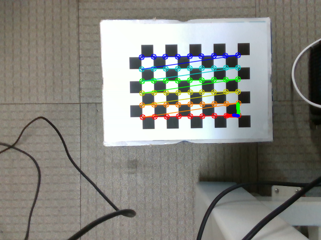
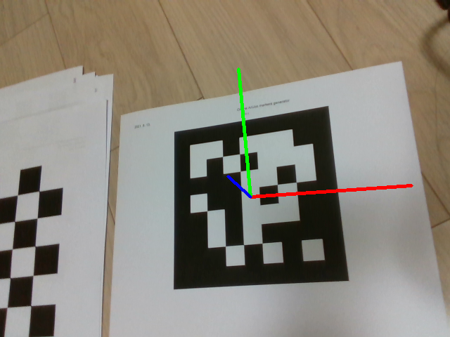

# opencv_camera_calibration

Camera calibration and pose estimation through checker board marker or aruco one

<Pose estimation through checker board marker>

<Pose estimation through aruco marker>

